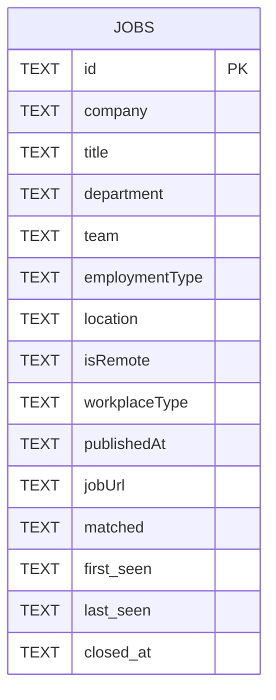
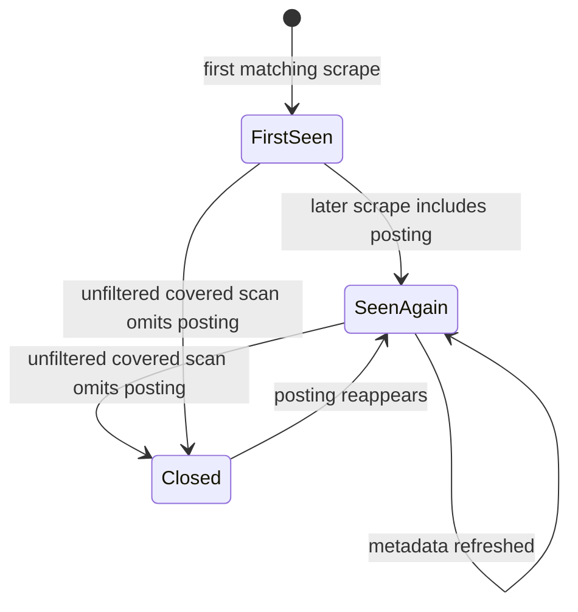

# Data model

The [job scrape workflow](../workflows/job-scrape.md) emits one flattened row per matching listed posting. The same row shape is written to CSV, JSON, and SQLite, while SQLite adds cross-run lifecycle fields. Board coverage from [board discovery](../workflows/board-discovery.md) determines when disappearance can be inferred.

## Row shape

`API_FIELDS` in `/ashby_jobs.py` selects fields directly from Ashby's job object:

- `id`
- `title`
- `department`
- `team`
- `employmentType`
- `location`
- `isRemote`
- `workplaceType`
- `publishedAt`
- `jobUrl`

`FIELDS` prepends `company` and appends `matched`. `company` is the board slug, not a separate legal entity lookup. `matched` is empty unless `--grep` found description fragments.

## Output files

| Output | Source behavior | Notes |
|---|---|---|
| CSV | `csv.DictWriter` with `FIELDS` | Written as UTF-8 with BOM for Excel compatibility. |
| JSON | `json.dumps(rows, indent=2)` | Snapshot of the current query's matching rows. |
| SQLite | `save(rows, db_path, seen_at, covered)` | Accumulates history across scrapes unless `--no-db` is set. |
| `boards.json` | `load_boards()` and dead-board pruning | Generated board cache, intentionally ignored by git. |

Generated `*.csv`, `*.json`, and `*.db` files are ignored by `.gitignore`; `/boards.seed.json` is the only committed JSON source file.

## SQLite schema

The table is created by `_SCHEMA` in `/ashby_jobs.py`. Indexes exist on `company`, `last_seen`, and `closed_at`. `save()` also migrates databases created before `closed_at` by adding the column if missing.

## Upsert rules

Rows are keyed by Ashby's posting UUID in `id`. Rows without an `id` are skipped. On conflict, `first_seen` is preserved, `last_seen` is refreshed to the current run timestamp, and most fields are overwritten because upstream titles, locations, and other posting metadata can change in place.

`matched` is the exception. If a later run has an empty `matched` value, it does not erase grep context found by an earlier `--grep` run. A later run with non-empty `matched` does update the stored context.

## Posting lifecycle

A missing posting only means closed when the run was exhaustive for that board. `main()` passes `covered=scanned` to `save()` only when there is no title filter and no grep pattern. Filtered runs pass `covered=None`, so they never stamp `closed_at`. This rule is central to the [operations runbook](../operations/runbook.md): schedule `--all` if you want fill-rate or disappearance signals.

Closing is scoped to boards actually scanned. If `--limit` scanned only `acme`, jobs on `other` must not be closed. Tests exercise filtered runs, scoped closing, and reopening when a previously closed posting reappears.

## Change guidance

Any schema or lifecycle change should be made with tests first or alongside source changes. Update [testing](../testing.md) for upsert preservation, migration behavior, filtered-run safety, and reopen behavior. Update [operations](../operations/runbook.md) if SQL examples or scheduling advice change.
