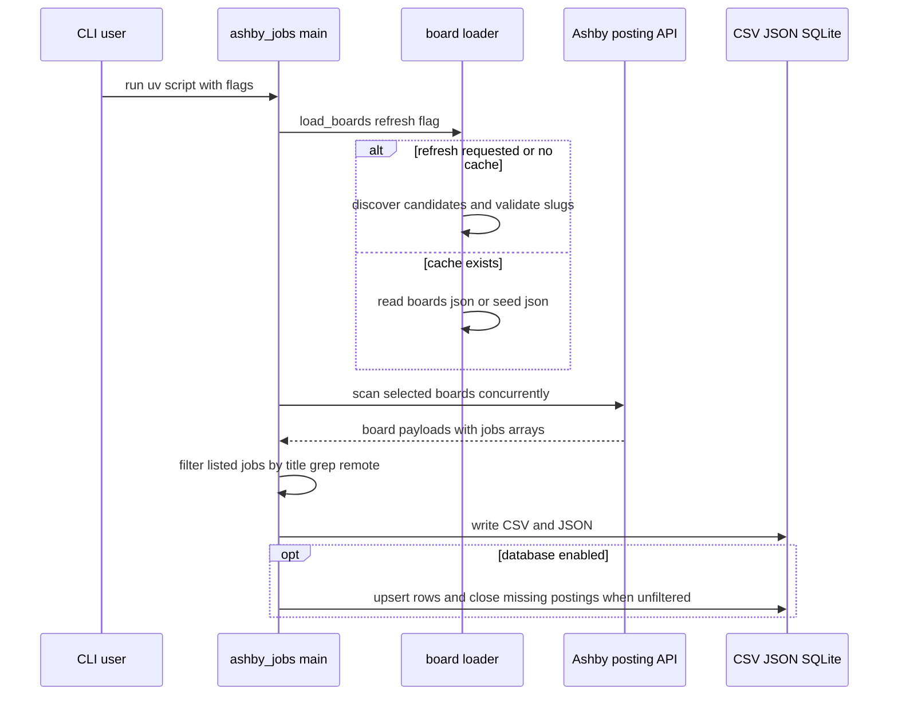

# Architecture overview

`/ashby_jobs.py` is a single-file CLI organized around two phases: discover or load board slugs, then scan those boards for listed postings. The [board discovery workflow](../workflows/board-discovery.md) supplies the slug universe, the [job scrape workflow](../workflows/job-scrape.md) applies user filters, and the [data model](data-model.md) persists the flattened results.

## Runtime flow

This diagram follows `main()`, `load_boards()`, `scan_board()`, and `save()` in `/ashby_jobs.py`.

## Main components

| Component | Source | Responsibility |
|---|---|---|
| CLI parser | `/ashby_jobs.py` `main()` | Validates flag combinations, compiles optional grep regex, derives default title behavior, selects board subset, orchestrates scanning and writing. |
| HTTP client | `/ashby_jobs.py` `fetch()` | Adds `User-Agent` and gzip headers, decompresses gzip responses, maps 404 to `NotFound`, maps 503 to `RateLimited`, and retries transient 5xx/URL errors. |
| Board loader | `/ashby_jobs.py` `load_boards()` | Reads generated `boards.json`, falls back to `/boards.seed.json`, or calls discovery on `--refresh-boards`. |
| Scanner | `/ashby_jobs.py` `scan_board()` | Fetches one board, validates payload shape, filters jobs, flattens API fields, and retains only grep fragments from descriptions. |
| Persistence | `/ashby_jobs.py` `save()` | Creates or migrates the SQLite table, upserts by Ashby posting UUID, preserves history, and stamps `closed_at` only when coverage is exhaustive. |

## Design constraints

The architecture exists because Ashby has no global public search endpoint. The README documents the public endpoint as `GET https://api.ashbyhq.com/posting-api/job-board/{slug}` and the code defines that URL as `POSTING_API`. Every global search therefore becomes many per-board reads.

The scraper also treats descriptions as heavy data. `scan_board()` reads `descriptionPlain` or `descriptionHtml` only when `--grep` is set, strips markup through `plain_text()`, stores at most two surrounding fragments from `fragments()`, and never includes whole descriptions in output rows. This keeps the [job scrape workflow](../workflows/job-scrape.md) aligned with the README claim that descriptions dominate payload size without changing CSV or database shape.

Concurrency is deliberately simple: `ThreadPoolExecutor(max_workers=args.concurrency)` fans out over board slugs in `main()`, and discovery validation uses the same pattern in `discover_boards()`. The README and code default to 8 workers for Ashby traffic, while Common Crawl paging is separately throttled in [board discovery](../workflows/board-discovery.md).

## Error handling boundaries

- A 404 while scanning a board marks the slug dead for the current run; if the run is not limited, the code rewrites `boards.json` without dead slugs.
- Board payloads without a `jobs` array raise `ValueError` so API shape changes fail loudly instead of looking like zero matches.
- `--all` cannot be combined with `--title` or `--grep`; only unfiltered scans have the standing to close missing postings in the [data model](data-model.md).
- Invalid grep regex exits before scanning; grep patterns without `\b` emit a warning because unbounded terms such as `rust` match words like `trust`.

## Historical notes

Git history explains why the architecture is shaped this way. The project began as a public Ashby board scraper. Later commits split the seed from the generated cache, added description grep, added SQLite accumulation, moved discovery to Wayback-first with `HEAD` validation, added `--all`, and finally added disappearance tracking through `closed_at`. When changing the architecture, preserve those hard-won boundaries unless source evidence shows they are obsolete.
