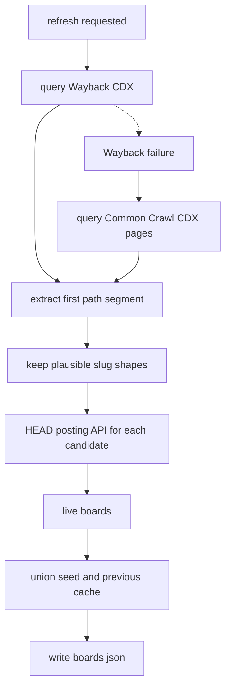

# Board discovery workflow

The [architecture overview](../architecture/overview.md) depends on this workflow to turn the absence of a global Ashby search endpoint into a reusable board-slug list. The [job scrape workflow](job-scrape.md) consumes the resulting slugs and assumes they are plausible live Ashby boards.

## Sources of board slugs

`load_boards(refresh, concurrency)` checks sources in this order:

1. If `--refresh-boards` is not set and generated `boards.json` exists, read it.
2. Otherwise, if `--refresh-boards` is not set and `/boards.seed.json` exists, read the curated seed.
3. Otherwise call `discover_boards()` and write the generated cache to `boards.json`.

`/boards.seed.json` is intentionally small and committed. It makes a fresh clone useful even when archive services are unavailable. Generated `boards.json` may contain thousands of discovered companies, so `.gitignore` excludes it.

## Discovery flow

The workflow is implemented by `candidates_from_wayback()`, `candidates_from_commoncrawl()`, `slug_from_url()`, `plausible()`, `board_exists()`, `discover_boards()`, and `load_boards()` in `/ashby_jobs.py`.

## Candidate extraction and shape filtering

`slug_from_url()` parses the first path segment of a `jobs.ashbyhq.com` URL and percent-decodes it, preserving real slugs that contain spaces such as `A1 Garage Door Service`. `_add()` deduplicates case-insensitively while keeping first-seen casing.

`plausible()` rejects archive noise before validation. It keeps slugs matching an alphanumeric start plus letters, numbers, spaces, dots, underscores, or hyphens up to 61 characters. It rejects known site plumbing such as `_next`, `api`, `static`, `assets`, `meeting`, `b`, and `favicon.ico`, as well as `root.` embed paths and UUID-like posting IDs. Tests pin both accepted real slugs and rejected junk.

## Validation and cache preservation

`board_exists()` validates a candidate by issuing `HEAD` to `POSTING_API`. A 200 means the board exists, and a 404 maps to false through `NotFound`. The README calls out why this matters: `HEAD` returns status with a zero-length body, avoiding gigabytes of payload that `GET` validation would download.

After validation, `discover_boards()` unions live archive-discovered boards with every slug already known in `/boards.seed.json` and generated `boards.json`. This is important because archive discovery can miss valid boards that were never crawled; the README names `newtonx` as an example of a live board added through the seed. This preservation relationship is also used by the [operations runbook](../operations/runbook.md): add a missed slug to the seed to make it permanent.

## Wayback first, Common Crawl fallback

The README and recent commit history show the project moved to Wayback-first discovery because Wayback returned a larger, more reliable URL set. Common Crawl remains in `candidates_from_commoncrawl()` as a fallback, but it is treated carefully:

- `collinfo.json` selects the latest collection.
- Pages are read as JSONL, not a JSON array.
- The code sleeps one second between pages.
- It avoids `showNumPages`, which the README describes as expensive.
- HTTP 503 raises `RateLimited` with guidance that Common Crawl considers this client-side rate pressure.

## Change guidance

When changing this workflow, update [testing](../testing.md) fixtures for URL parsing, JSONL parsing, plausible slug filtering, and `HEAD` validation. When changing cache semantics, update the [data model](../architecture/data-model.md) only if coverage or closing behavior changes, and update the [operations runbook](../operations/runbook.md) if git hygiene or seed guidance changes.
