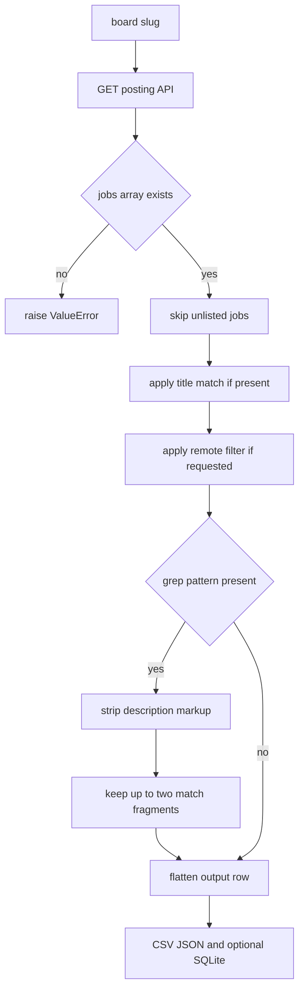

# Job scrape and search workflow

This workflow consumes slugs from [board discovery](board-discovery.md), calls Ashby's per-board posting API, filters listed postings, and emits rows shaped by the [data model](../architecture/data-model.md). It is the main path engineers touch when changing user-visible CLI behavior.

## CLI filter semantics

`main()` in `/ashby_jobs.py` defines the user contract:

- `--all` means every listed job on every scanned board. It cannot be combined with `--title` or `--grep`.
- `--title` filters titles. If no narrowing option is supplied, the default title is `software engineer`.
- `--grep REGEX` searches descriptions with a case-insensitive regex. If `--grep` is supplied without `--title`, the title filter is dropped instead of silently ANDing the default title.
- `--title` and `--grep` together are ANDed.
- `--remote` keeps only jobs where Ashby's `isRemote` field is truthy.
- `--limit` scans only the first N loaded boards.
- `--concurrency` controls the thread-pool size and defaults to 8.

## Per-board scan flow

`scan_board()` implements the branch logic and `main()` writes the outputs.

## Title matching

`matches(job_title, wanted, mode)` has two modes:

- `exact`: case-insensitive and whitespace-trimmed equality.
- `fuzzy`: the query may be contained in the title, or the title may be contained in the query when the title has at least two words.

The two-word guard prevents a long query such as `senior software engineer` from matching every one-word title like `Engineer`, `Software`, or `Senior`. Empty title or empty query returns false.

## Description grep

`--grep` compiles a case-insensitive Python regex. `scan_board()` turns `descriptionPlain` or `descriptionHtml` into plain text with `plain_text()`, extracts up to two context windows with `fragments()`, and joins them with ` … ` into the `matched` column. Full descriptions are not retained, which keeps this workflow compatible with the [data model](../architecture/data-model.md) and the README's memory/payload guidance.

The CLI warns when a grep pattern contains no `\b` word boundary because terms can match inside boilerplate words. The tests document the real footgun: `rust` also matches `trust`, while `\brust\b` avoids that false positive.

## Board-level failures

The worker function inside `main()` retries each board once for non-404 exceptions. A `NotFound` marks the board dead for the run. After an unlimited run, dead boards are pruned from generated `boards.json` so future runs skip them. Limited runs do not rewrite the full cache.

Payload shape failures are not swallowed by `scan_board()`; missing `jobs` raises `ValueError`. The surrounding worker logs the board after the second failed attempt and continues scanning others, which keeps broad scrapes resilient without hiding API-shape regressions in tests.

## Output writing

Rows are sorted by lowercased company and title, then written to:

- `${out}.csv` using UTF-8 with BOM so Excel handles punctuation in locations.
- `${out}.json` as indented JSON rows.
- The SQLite database unless `--no-db` is set.

Only an unfiltered run passes its scanned-board list as coverage to `save()`. That link to [data model](../architecture/data-model.md) is what allows disappearance tracking without confusing filtered misses for closed postings.

## Change guidance

When adding a filter, decide whether it narrows coverage. If it does, it should probably prevent closing missing postings just like title and grep filters. Add or update tests in [testing](../testing.md) for defaulting, filter composition, output row shape, and database side effects.
